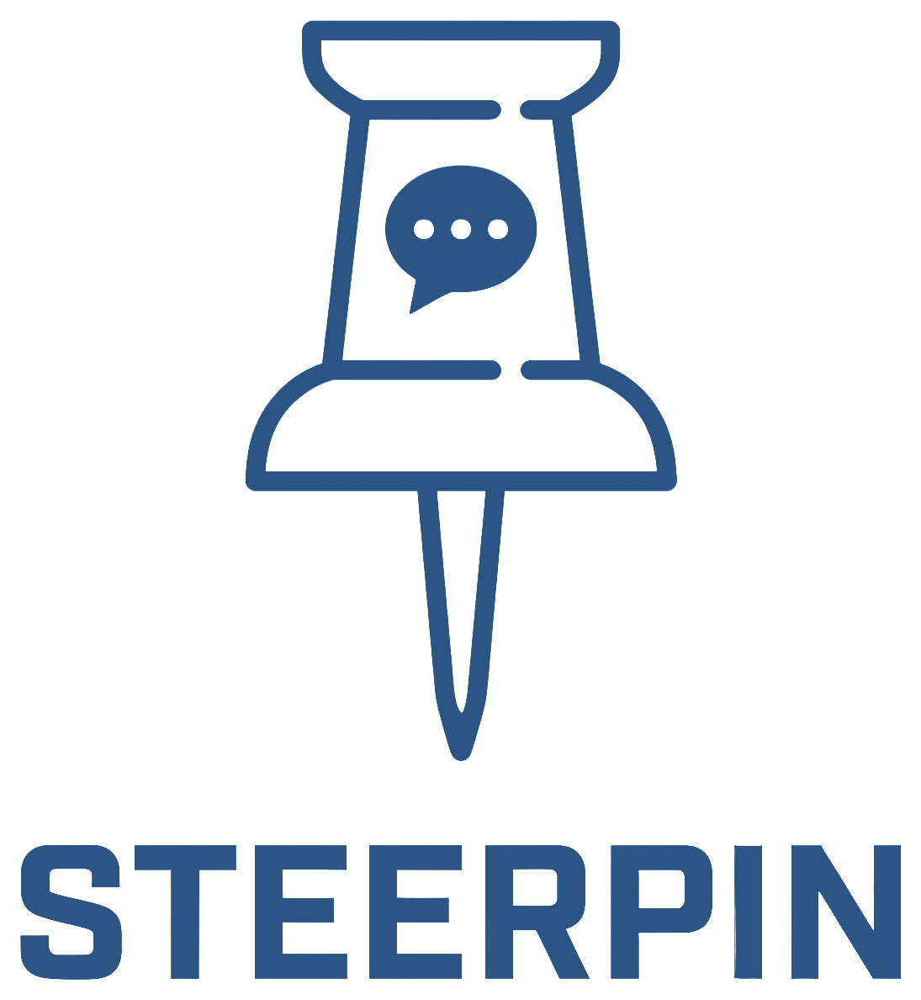

<picture>
  <source media="(prefers-color-scheme: dark)" srcset="assets/steerpin-logo-dark.png">
  
</picture>

Highlight text in Claude Code and mark it Priority or Wrong with a hotkey. Your marks persist across turns, helping Claude stay focused, avoid bad assumptions, and reduce repeated corrections.

**Steer Claude.** Sent with every message until you remove them:

| Keys | Mark | What Claude does |
|---|---|---|
| `⌥⇧R` | **Priority** | Keeps it at the top of its attention, every turn |
| `⌥⇧W` | **Wrong** | Stops relying on it, and corrects anything built on it |

**Save notes.** Written to your project, word for word. Claude doesn't see them:

| Keys | Mark | Saved to |
|---|---|---|
| `⌥⇧A` | **Add to roadmap** | `.claude/steerpin/roadmap.md` |
| `⌥⇧S` | **Save for later** | `.claude/steerpin/later.md` |

**Manage:**

| Keys | Action | What happens |
|---|---|---|
| `⌥⇧Z` | **Undo** | Removes your last mark before it's sent |
| `⌥⇧C` | **Copy marks** | Copies the priority and wrong marks of your most recent project, to paste anywhere |

`⌥` is Option and `⇧` is Shift. All the keys sit under your left hand.

**Works in Claude Code:** in the terminal, or in the Code tab of the Claude desktop app. Not in Claude chat (claude.ai, the desktop app's Chat tab) or Cowork, which can't receive marks automatically. There you can paste them with `⌥⇧C`.

**Why:** in long sessions, important points drift out of focus and wrong statements get reused as fact. The chat has no way to mark text, and plugins can't add buttons to it. So Steerpin marks text with system-wide hotkeys, and a Claude Code hook passes the marks to Claude. They survive long chats and `/compact`.

## Setup

About three minutes. You need:

- macOS 13 or later (on other systems, see [Without hotkeys](#without-hotkeys))
- [Claude Code](https://code.claude.com)
- [Node.js](https://nodejs.org) 18 or later. Check with `node --version`.

### Step 1: download the app

**[Download Steerpin.zip](https://github.com/gregkozakiewicz/steerpin/releases/latest/download/Steerpin.zip)**, unzip it, and drag **Steerpin.app** into **Applications**.

Steerpin is a small menu bar app. It owns the hotkeys, copies your selection, puts your clipboard back, and confirms each mark with a popup under its pin icon.

### Step 2: open it

The app isn't signed with a paid Apple developer account, so the first time you open it macOS shows **"Steerpin" Not Opened**:

1. Click **Done**, not Move to Bin. Nothing else happens yet; that's expected.
2. Open **System Settings › Privacy & Security** and scroll all the way down to **Security**. Next to *"Steerpin" was blocked to protect your Mac*, click **Open Anyway**, and confirm with your password or Touch ID.
3. macOS asks one last time, now with an **Open Anyway** button. Click it, and Steerpin starts.

You only do this once. If you don't see the "was blocked" line, open Steerpin from Applications again, click **Done**, and look again.

### Step 3: allow Accessibility

macOS asks right away. Click **Open System Settings** and turn on **Steerpin**. The app needs this to copy your selection, and it's the only permission it asks for.

When the pin icon appears in your menu bar and **Steerpin is ready** shows under it, this step is done.

### Step 4: connect to Claude Code

The app asks **Connect Steerpin to Claude Code?** Click **Connect**. It installs the Steerpin plugin into Claude Code for you. Then quit and reopen Claude Code.

Missed the question? Click the pin icon › **Connect to Claude Code**.

Finally, click the pin icon and turn on **Launch at Login**, so the hotkeys keep working after a restart.

### Test it

1. Select a sentence anywhere, for example in a browser.
2. Press `⌥⇧R`. A popup under the pin says **Marked as priority**.
3. In Claude Code, send any message. You'll see `steerpin: new mark [1]`, and Claude now has the mark.

If something doesn't work, see [Troubleshooting](#troubleshooting).

## Using it

1. Claude writes an answer.
2. Select the part you want to mark and press a hotkey. The popup tells you which mark you made.
3. Send your next message as normal.

With your message, Claude receives your active marks:

```
USER MARKS (set by the user by highlighting text in this chat)

Priority, keep these at the top of your attention:
[1] Tokens must stay platform-agnostic until the export step

Flagged as wrong, do not rely on or repeat these. If anything
you said or built depends on them, say so briefly and correct it:
[2] "Style Dictionary can't handle composite tokens"

New since last message: [2]
Start your reply with one short line per new wrong mark, e.g. "Noted, [2] was wrong: <what is actually true>". Then answer the message.
```

When you mark something as wrong, Claude opens its next reply with a line like *"Noted, [2] was wrong: …"*. Priority and wrong marks are sent again with every message until you remove them. Roadmap and later marks are written to their files once and aren't sent to Claude.

### Undo

- **Before you send your next message:** press `⌥⇧Z` (or pin menu › **Undo Last Mark**). The newest waiting mark is removed, and Claude never sees it.
- **After you sent it:** run `/steerpin:undo` in Claude Code. It removes what that message delivered, and if a mark replaced an older one (priority re-marked as wrong), it brings the old one back.

### Projects in the menu

The pin menu lists your 5 most recent Claude Code projects that have marks, newest first, with how many priority and wrong marks each has. A project you've just cleared stays in the list, marked **cleared**, so you can still undo. Each project has its own menu:

| Menu item | What it does |
|---|---|
| **Copy Priority and Wrong Marks** | Copies them as a block you can paste into any chat, with a line asking the assistant to keep applying them. `⌥⇧C` does this for the most recent project. |
| **Copy Saved Marks** | Copies everything in the project's saved-for-later list |
| **Copy Roadmap Marks** | Copies everything in the project's roadmap |
| **Open Marks File** | Opens the project's `marks.md` |
| **Clear Priority and Wrong Marks…** | Asks first, then removes them: Claude stops receiving them. Roadmap and saved marks stay. |
| **Undo Clear** | Puts the cleared marks back. Available until you clear that project again. |

The menu reads the same files Claude sees, so it always matches what Claude has. Marks you made but haven't sent yet count toward the most recent project.

### The menu bar app

Click the pin icon to:

- mark selected text by clicking **Priority**, **Wrong**, **Add to roadmap** or **Save for later**, instead of using the shortcuts
- see how many marks are waiting for your next message, and your recent marks
- work with your **Projects** (above)
- check the **Claude Code** connection. When a newer plugin is published, it offers **Update Plugin**.
- turn on **Launch at Login**
- quit. The **Quit Steerpin** item also shows which version you have.

A crossed-out pin means Accessibility access is off.

### Commands

| Command | What it does |
|---|---|
| `/steerpin:marks` | List active marks with their ids |
| `/steerpin:unmark 3` | Remove mark 3. Several at once: `/steerpin:unmark 3 5` |
| `/steerpin:clear-marks` | Remove all priority and wrong marks. Roadmap and later files are not touched |
| `/steerpin:undo` | Take back everything your last message delivered: marks, roadmap and later items |
| `/steerpin:mark wrong <text>` | Mark text without a hotkey. Also `priority`, `roadmap`, `later` |

## Troubleshooting

**Nothing happens when I press the keys.**
- Check that Steerpin is running: the pin icon should be in the menu bar. If not, open it from Applications.
- If the pin is crossed out, click it › **Allow Accessibility Access…** and turn Steerpin on.
- If Accessibility looks on but the pin stays crossed out, macOS is holding an outdated entry. This can happen once when updating from 0.2.1 or earlier. Run `tccutil reset Accessibility com.gregkozakiewicz.steerpin` in Terminal, then allow Steerpin again.
- Click the pin icon. If a mark says **(shortcut used by another app)**, another app has taken that key combination. Quit that app, then quit and reopen Steerpin.

**I can't see the pin icon.**
Open Steerpin again from Applications or Spotlight. A window confirms it's running and can open **System Settings › Menu Bar**, where Steerpin must be switched on under **Allow in the Menu Bar**. If it's on, your menu bar is probably full: macOS hides icons that don't fit, especially next to the camera notch. The same window can also quit Steerpin.

**The popup says "No text selected".**
Select the text again and press the key while the selection is still highlighted. Some apps clear the selection when you click elsewhere.

**Claude doesn't see my marks.**
- Click the pin icon and check that the **Claude Code** section says **Connected**. If it offers **Connect** or **Update Plugin**, click it.
- Quit and reopen Claude Code after connecting.
- Check that Node.js works: `node --version`.
- Run `/steerpin:marks` to see what's active.

**My clipboard changed.**
It shouldn't: Steerpin puts back whatever you had copied. If it happens, tell us in an [issue](https://github.com/gregkozakiewicz/steerpin/issues) which app you were marking from.

## Installing the plugin by hand

The app installs the plugin for you. To do it yourself instead, for example on Linux or Windows, run these in Claude Code, then restart it:

```
/plugin marketplace add gregkozakiewicz/steerpin
```

```
/plugin install steerpin@steerpin
```

## Without hotkeys

On Linux or Windows, or if you'd rather not install the app, mark text inside Claude Code with `/steerpin:mark`:

```
/steerpin:mark wrong esbuild can't generate type declarations
```

Other hotkey tools (Raycast, Keyboard Maestro, AutoHotkey) can write to the same inbox by running:

```bash
node ~/.claude/plugins/marketplaces/steerpin/scripts/steerpin.mjs capture wrong "the selected text"
```

## Settings

Optional, per project, in `.claude/steerpin/config.json`. Anything you leave out uses the default:

```json
{
  "roadmap": ".claude/steerpin/roadmap.md",
  "later": ".claude/steerpin/later.md",
  "maxActiveMarks": 15,
  "maxMarkLength": 500
}
```

- `roadmap`, `later`: where saved items go, relative to the project root. Missing files and folders are created. To share your roadmap with the team, point it somewhere git tracks, such as `"docs/roadmap.md"`. Paths outside the project, and symlinks, are refused: a cloned repo can't make Steerpin write to your dotfiles.
- `maxActiveMarks`: at most this many marks (the newest) are sent to Claude.
- `maxMarkLength`: longer marks are shortened in what Claude sees. The full text stays in `marks.md`.

## Where things are saved

Everything stays private to you. In each project, in `.claude/steerpin/`:

| File | What | Removed by **Clear Priority and Wrong Marks**? |
|---|---|---|
| `marks.md` | Active priority and wrong marks | Yes |
| `roadmap.md` | Roadmap items | No |
| `later.md` | Save-for-later items | No |
| `config.json` | Optional [settings](#settings) | No |
| `cleared.md`, `cleared-inbox.jsonl` | The marks from your last clear, so **Undo Clear** can bring them back | Replaced by the next clear |
| `last-delivery.json` | What your last message delivered, so `/steerpin:undo` can take it back | No |

In your home folder, in `~/.steerpin/`:

| File | What |
|---|---|
| `inbox.jsonl` | Marks waiting for your next message. Emptied when you send it |
| `projects.json` | Your recent Claude Code projects, for the pin menu |

All of these are plain Markdown or JSON, so you can open and edit them by hand. (`/steerpin:clear-marks` in Claude Code does the same as the menu's Clear, without the undo.) `~/.steerpin` and the marks files are readable by your user only, since marked text can hold anything you selected.

If a setting in `config.json` is invalid, Steerpin uses the default for it and tells you which one with your next message.

The first time Steerpin saves something in a git repository, it adds `.claude/steerpin/` to the project's `.gitignore` and tells you once. Your marks, roadmap and later items are never committed unless you change that.

Each project folder has its own set. Opening Claude Code in a different folder starts with no marks; the old folder's marks are still there when you go back.

## Good to know

- **New chat, same project.** Marks belong to the project folder, so a new chat starts with the old ones. You'll see `steerpin: 3 marks carried over from an earlier chat…`. Keep going if you're continuing the same work, or clear them from the pin menu (project › **Clear Priority and Wrong Marks…**) to start fresh.
- **Two Claude Code sessions open at once.** The hotkeys don't know which project you're in. Marks go to whichever session you send the next message in.
- **Marking while Claude is still answering** is fine. The marks arrive with your next message.
- **Marking the same text twice** does nothing. Marking it with a different type (priority, then wrong) replaces the old mark.
- **If something breaks**, your message still goes through. Steerpin never blocks a prompt.

## Development

```bash
node test/run-tests.mjs
```

```bash
macos/app/build.sh
```

The app is plain Swift built with the Command Line Tools, no Xcode needed. `build.sh` makes a universal `Steerpin.app` and `Steerpin.zip` in `macos/app/build/`.

```bash
claude --plugin-dir .
```

Set `STEERPIN_HOME` to use a separate inbox folder while testing.

## License

MIT
